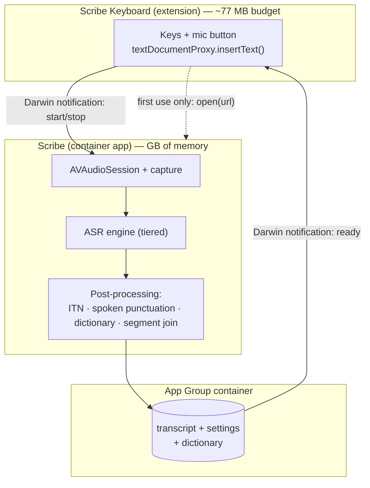

# Scribe on iOS — architecture

How Clarity Scribe reaches iPhone, and why the design looks nothing like the
desktop app. Written after researching Apple's extension limits and the
on-device ASR landscape (July 2026); every hard constraint below is cited, so
future-us can re-check them rather than re-derive them.

**The one-line summary:** the keyboard is the surface, the app is the engine.
Everything else follows from that, because a keyboard extension cannot record
audio and cannot hold a model.

---

## 1. The walls

These are not tuning problems. Each one independently kills the obvious design
(a self-contained dictation keyboard), and they are worth stating plainly
before any code is written.

| # | Wall | Evidence |
|---|---|---|
| 1 | **A keyboard extension cannot access the microphone.** | Apple: *"Custom keyboards, like all app extensions in iOS 8.0, have no access to the device microphone, so dictation input is not possible."* iMessage extensions are the sole documented exception. The rejection happens in CoreMedia (`CMSUtility_IsAllowedToStartRecording … NOT allowed … because it is an extension`) before any permission prompt — **there is no entitlement to request.** Confirmed on device with Full Access *and* mic permission granted; radar FB16791704 (Mar 2025) unresolved. |
| 2 | **Nothing can start a recording from the background.** | Apple DTS: a privacy block prevents recording sessions activating in the background; only CallKit / LiveCommunicationKit / PushToTalk may, and only for their stated purpose. |
| 3 | **Keyboard extensions get ~77 MB.** | Measured ceiling (memory warning ~55 MB, ~30–40 MB usable). The extension-point limit **overrides** the Increased Memory Limit entitlement — DTS: *"I don't think it's actually possible for the system to grant your app extension more memory."* Our Parakeet build is ~483 MB. |
| 4 | **iOS 26.4 removed host-app identification.** | `_hostBundleID`, `LSApplicationWorkspace`, `proc_pidpath()` etc. all return nil/EPERM. Apple DTS answered "No" to both public-API alternatives. Consequence: an app cannot programmatically return the user to the app they were typing in. |

Wall 1 is why every shipping voice keyboard — Gboard, Grammarly, Wispr Flow,
superwhisper — bounces to its containing app. We are not going to find a
clever way around something Apple documents as impossible; we design for it.

**Also live:** iOS 27 restricts background Neural Engine access and now
attributes ANE memory to the app process (FluidAudio issue #738, open). And
at WWDC 2026 Apple shipped systemwide dictation in the iOS 27 keyboard — we
are now competing with the platform owner here.

---

## 2. Components

- **Keyboard extension** — deliberately dumb. Draws keys, owns the mic button,
  reads a finished transcript out of the shared container and inserts it. No
  audio, no model, no network. Must stay far under the memory ceiling.
- **Container app** — does everything real: recording, ASR, post-processing,
  history, settings, dictionary, model downloads.
- **App Group** — the only sanctioned channel between them. Carries the
  transcript, settings, and dictionary. Darwin notifications signal both ways
  (they carry no payload — the payload lives in the container).

---

## 3. The session model — the mechanism that makes it usable

A naive design bounces to the app on *every* utterance. Since iOS 26.4 broke
the return trip, that means the user manually swipes back **every time** —
which competitors are currently telling their users to do. Unacceptable.

The fix is the trick every serious competitor converged on (Wispr calls it a
"Flow Session", Grammarly "Background Microphone"): **get the microphone hot
once in the foreground, then keep it.**

1. **First mic tap in a session** → keyboard calls `open(url)` on our own
   scheme (App-Review-approved for one's *own* container app; 4.4.1's "other
   apps" excludes it). App foregrounds, starts `AVAudioSession`, declares the
   `audio` background mode, and holds the session open. User swipes back.
2. **Every later tap** → the session is already active, so the app can record
   **from the background** (legal: wall 2 forbids *starting* in the
   background, not continuing). Keyboard posts a Darwin notification; the app
   records, transcribes, writes the transcript to the App Group, and signals
   back. **No app switch, no swipe.**
3. **Session expiry** — user-configurable (5 min / 15 min / 1 hr / never),
   mirroring competitors. Expiry costs one foreground visit, nothing more.

This turns the platform limitation into a single up-front cost per session
instead of a tax on every sentence.

---

## 4. ASR strategy — two tiers, both on-device

Neither engine alone is right, and using both costs little because
post-processing is shared.

| | **Apple `SpeechTranscriber`** | **Parakeet TDT via FluidAudio** |
|---|---|---|
| Availability | iOS 26+, iPhone 12+, no Simulator | iOS 17+ (declared in `Package.swift`) |
| Download | **0 bytes** — system asset | ~483 MB (int8) / ~335 MB (int4) |
| Runtime memory | **0** — runs out of our process | ours (fine in the app, fatal in the keyboard) |
| Permission | mic only — **no speech permission** | mic only |
| Speed | speed factor ~70 | **~180×** real-time on iPhone (ANE 4.3× faster than GPU) |
| Accuracy (English) | ~14% WER on a hard set | our current desktop quality |
| Code shared with macOS | none | **all of it** |

**Tier 1 — Apple `SpeechTranscriber`: usable the second the app is installed.**
Zero download, zero memory, no speech-recognition permission prompt, and Apple
documents that it *"doesn't send audio data of the user's voice to Apple's
servers"* — a stronger guarantee than the old `SFSpeechRecognizer`, whose
on-device flag silently no-ops on unsupported device/locale pairs.

**Tier 2 — Parakeet, downloaded in the background.** Our differentiator, an
order of magnitude faster than Whisper on iPhone, and the reason the macOS
engine work carries over. Becomes the default once present.

This ordering means **no one waits on a 483 MB download to dictate their first
sentence**, and devices that can't run `SpeechTranscriber` still get Parakeet.

### Live transcript

Our signature UX — words appearing as you speak, finalized ~0.5 s after you
stop — **does not come free**, because plain Parakeet TDT is a sliding window
over a fixed 15 s non-causal encoder, not a streaming model.

Two supported routes, both preserving the volatile→final contract we already
have on desktop:

- **`SpeechTranscriber`** has it natively: `volatileResults` / `fastResults`,
  `result.isFinal`, explicit `finalize(through:)`.
- **Parakeet EOU 120M** is purpose-built for it: 160/320/1600 ms chunks with
  **built-in end-of-utterance detection** — literally the mechanism behind
  "finalize after you stop". Pair it with a batch Parakeet 0.6B pass over the
  full utterance for the committed text: live speed from the small model,
  final accuracy from the large one.

---

## 5. Model delivery

- Ship the app **without** the weights. Use **Background Assets** in
  `prefetch` phase — downloads after install, in the background, without
  blocking first launch. (`essential` blocks app launch on ~483 MB; that is a
  conversion killer. On-Demand Resources is deprecated as of iOS 27 — do not
  start there.)
- Offer the **int4 encoder (~335 MB, −31%)** as a low-storage option. Note
  FluidAudio publishes no WER delta for int4 — **measure before defaulting to
  it**.
- Store under `applicationSupportDirectory`, never `cachesDirectory` (the
  system purges caches; FluidAudio's own TTS models were bitten by this).
- App Review 4.2.3(ii) expressly permits runtime model download: disclose the
  size and prompt first.

---

## 6. What ports, what doesn't

**Ports nearly as-is** — this is the argument for staying on FluidAudio:

- Parakeet CoreML artifacts, `AsrManager` concepts, model-version handling
- Text post-processing: ITN, spoken punctuation, filler removal, personal
  dictionary, and the new **`segmentJoin`** sentence-boundary repair
- History model, settings shape, streaming volatile→final contract

**Does not port:**

| Desktop | iOS |
|---|---|
| Paste-to-target (SendInput / AXUIElement) | `textDocumentProxy.insertText()` — no equivalent of system-wide injection exists, and iOS accessibility APIs are outbound-only |
| Global hotkey | Keyboard mic button; Action Button / Back Tap / Shortcut as secondary triggers |
| Always-on-top widget | Live Activity / Dynamic Island for the recording HUD |
| Command mode & screen agent | **Not ported.** No accessibility automation exists on iOS. Out of scope, by platform design |

**Note for the Mac product:** Mac App Store guideline 2.4.5 is actively
rejecting dictation apps that inject text via the Accessibility API (2026
precedent). Direct/notarized distribution is unaffected — but MAS is
effectively closed to our current paste mechanism.

---

## 7. App Review requirements

- **4.4.1** — the keyboard must **remain functional without Full Access**.
  Read carefully: it must work *as a keyboard*. Dictation may be the enhanced
  path behind Full Access (which we need anyway, for App Group *writes* and
  for `open()` on iOS 26+). **Design requirement: typing works with Full
  Access off; the mic button explains what to enable.** Historic rejections
  in this area are overwhelmingly "keyboard doesn't work with Full Access
  off".
- **2.5.14** — explicit consent and a **clear visible recording indicator**.
- **5.1.2(i)** (amended Nov 2025) — explicit consent before sharing personal
  data with third parties *including third-party AI*. **On-device processing
  sidesteps this entirely** — a real advantage over Grammarly and Wispr Flow,
  both of which round-trip to a server.
- **Privacy manifests** — the `.appex` needs its **own** `PrivacyInfo.xcprivacy`.
  Required-reason APIs: `UserDefaults` reason **`1C8F.1`** (app group, *not*
  `CA92.1`), and `ActiveKeyboards` reason **`3EC4.1`** (which forbids sending
  that data off-device). Failures surface as **ITMS-91053 at upload**, not at
  review.

---

## 8. Risks and open questions

| Risk | Handling |
|---|---|
| **FluidAudio #760** — v3 CoreML export drops/mangles a word when ≥~4 s follows it inside the 15 s window. Affects **our shipping macOS build today**. | Verify against our sidecar and track upstream *before* building on it |
| **iOS 27 background ANE restriction** (#738) | May throttle long/background dictation, and ANE memory now counts against our jetsam budget. Test on iOS 27 early |
| int4 accuracy unknown | Measure WER before offering it as anything but an opt-in |
| Apple ships systemwide dictation (iOS 27) | Compete on accuracy, custom vocabulary, history, and privacy — not on convenience alone |
| `SpeechTranscriber` assets can be purged by the system | Never assume installed; check and re-request |
| No Simulator support for `SpeechTranscriber` | Device-based test loop; keep an engine-selection seam for CI |

**Verify on device before committing** (both flagged as unverified by the
research): whether a Shortcut can genuinely start a background session as one
competitor claims, and the exact iOS 26 Full Access warning string.

---

## 9. Phasing

1. **Prove the loop.** Container app records → `SpeechTranscriber` → App Group
   → keyboard inserts. No Parakeet, no downloads. This validates the session
   model, the handoff, and Full Access on real hardware — the parts most
   likely to surprise us.
2. **Session persistence.** Background mode, expiry policy, HUD. This is what
   makes it feel native rather than a workaround.
3. **Parakeet via FluidAudio** + Background Assets delivery, engine switch,
   port the post-processing pipeline.
4. **Live transcript** — EOU streaming or `SpeechTranscriber` volatile results.
5. **Parity polish** — dictionary, history, settings sync through the App
   Group.

Each phase is independently shippable, and phase 1 answers the riskiest
questions with the least code.
